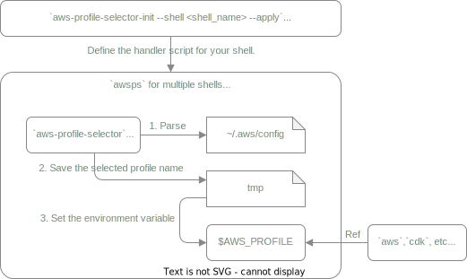

# aws-profile-selector

**aws-profile-selector** is a fast CLI that lets you browse every
profile declared in `~/.aws/config`, fuzzy-filter them as you type, and export the
selection to `AWS_PROFILE`—all in one key-stroke.

\* Only uses runtime dependencies already shipping in the `@inquirer/*` family and
`chalk`, so it installs quickly and keeps the bundle size tiny.

---

## ✨ Features

| Feature                | Details                                                                                                        |
| ---------------------- | -------------------------------------------------------------------------------------------------------------- |
| **TUI picker**         | Arrow-keys to move / `ESC` to cancel / `Enter` to confirm                                                      |
| **Fuzzy search**       | Powered by [Fuse.js](https://fusejs.io)                                                                        |
| **Table layout**       | Fixed header + borders; column widths auto-fit to longest value                                                |
| **Cross-shell helper** | `aws-profile-selector-init --shell <shell> --apply` adds an `awsps` function to bash / zsh / fish / PowerShell |
| **MIT licensed**       | Free for commercial & personal use                                                                             |

---

## 🚀 Installation

```bash
# Global (recommended)
npm i -g aws-profile-selector

# Local project
npm i --save-dev aws-profile-selector

# Setup shell helper
# <shell_name> ::= bash|zsh|fish|powershell
aws-profile-selector-init --shell <shell_name> --apply
```

Note: Edit your shell’s RC file to map Ctrl + T to the script by default.
If you need to remove the binding or assign a different key, simply modify the RC file directly.

## Usage

Ctrl+T (default) or run the command directly:

```bash
awsps
```

## ️How it works



| #   | component                       | responsibility                                                                                                                                    |
| --- | ------------------------------- | ------------------------------------------------------------------------------------------------------------------------------------------------- |
| 1   | **`aws-profile-selector`**      | Parses `~/.aws/config`, shows an interactive list, lets you choose a profile.                                                                     |
| 2   | **temp file**                   | The chosen profile name is written to a temp file (XDG-compatible location on Linux/macOS, `%TEMP%` on Windows).                                  |
| 3   | **`awsp` shell wrapper**        | Runs in _bash_, _zsh_, _fish_, or _pwsh_.<br>Reads the temp file and exports `AWS_PROFILE` so any child process (`aws`, `cdk`, etc.) inherits it. |
| –   | **`aws-profile-selector-init`** | Generates a tiny _RC-snippet_ that binds <kbd>Ctrl + T</kbd> to `awsp`.                                                                           |

## Contributing

PRs & issues are welcome!
Please:

- keep one feature/fix per PR
- run `npm run lint` before committing
- include Jest tests for new logic
- keep table width ≤ 80 cols

## License

Released under the MIT License – see [LICENSE](./LICENSE) for full text.
Made with ☕ and ❤️ in Tokyo.
